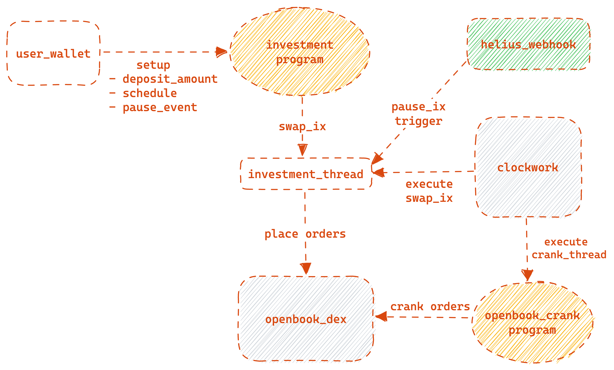

# Maius Invest

Maius Invest is an automation investment dApp with conditional [dollar cost averaging](https://academy.binance.com/en/glossary/dollar-cost-averaging) style.

| Program | Devnet | Mainnet Beta |
| --------|--------|------------- |
| [Maius Invest](/programs/maius_invest)     | `EZgeH8NyKikE796CWWnYQfYJ839piWatDjJzXLJS1FvR` | coming soon |
| [Openbook Crank](/programs/openbook_crank)     | `2BCWsXMC2KPB612DssxTdG4jUH5Z32GAdywUPRsGDtzA` | coming soon |

## Acknowledgement

- This project was built during the [Solana Sandstorm hackathon](https://www.sandstormhackathon.com) and is strongly inspired by [Clockwork](https://github.com/clockwork-xyz) and [Dcaf Drip](https://github.com/dcaf-labs) projects.

- Maius Invest is in active development and the code is unaudited. Please use at your own risk.

## Architecture Overview

### Explain
- User sets the necessary parameters for the DCA (deposit_amount, schedule, pause_event,...) and deposits token into the investment vault.

- Each user will have their own investment vault, and each investment vault will have an investment thread managed by the [Clockwork Thread](https://github.com/clockwork-xyz/clockwork/tree/main/programs/thread) program.

- The investment thread contains a swap instruction to place orders on the [Openbook Dex](https://github.com/openbook-dex/program) according to an established schedule.

- A dedicated backend integrated with the [Helius](https://helius.xyz) webhook is used to pause the investment thread if a pause_event occurs on the Solana network.

- At the same time, the [Openbook Crank](/programs/openbook_crank) program is run to ensure order matching for the investment vault.

## Local development
### Prerequisites
- Install [solana cli](https://docs.solana.com/cli/install-solana-cli-tools) and [anchor cli](https://www.anchor-lang.com/docs/installation)
- Install [yarn](https://classic.yarnpkg.com/lang/en/docs/install)
- Install [nodejs](https://nodejs.org/en/download)
- Install [clockwork engine](https://github.com/clockwork-xyz/clockwork) locally if you want to test on localnet

## Run the app
### Programs and Local Validator
- Run `anchor build` 
- Run `anchor keys list` to get the program's IDs
- Copy those IDs and replace them into the files `maius_invest/src/id.rs` and `openbook_crank/src/id.rs` respectively.
- Run `./run.sh` to start a local validator with Clockwork Engine, Maius Invest program, Openbook program and Openbook Crank program.
### Backend
- Navigate to the `backend` directory
- Run `yarn && yarn dev`
  
> **_NOTE:_**  You need to deploy this backend to the server or use a serverless service to be able to work with Helius webhook.
### Test Client
- Navigate to the `client` directory
- Run `cargo run` 
### App
- Navigate to the `app` directory
- Run `yarn && yarn dev`

## License

Maius Invest is open source and available under the Apache License, Version 2.0. See the [LICENSE](./LICENSE) file for more info.